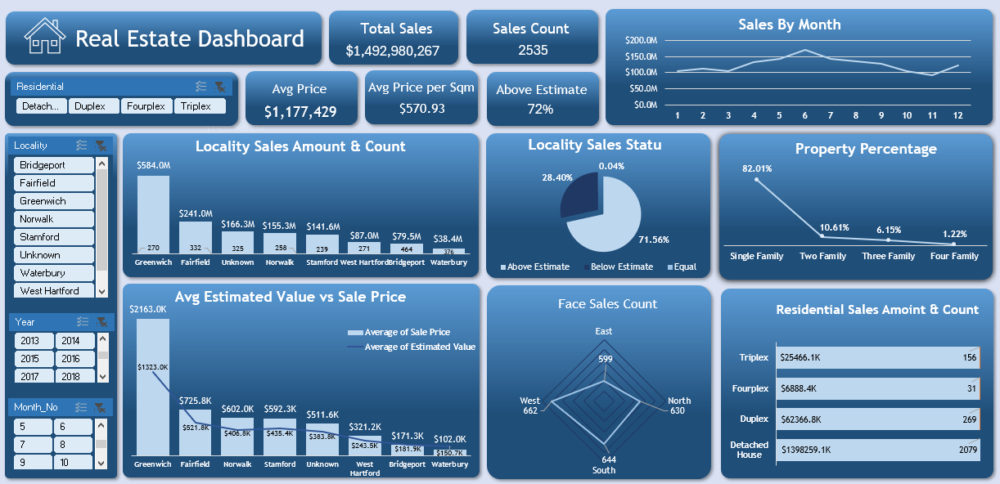

# Real Estate Data Analysis

## Project Objective

This project is an exploratory data analysis (EDA) of a real estate dataset covering property sales across multiple localities. The goal was to understand pricing patterns, property types, sales performance compared to estimated values, and overall market behavior over time. It is part of a Data Analyst portfolio designed to demonstrate skills in data cleaning, analysis, and visualization using Excel.

---

## Dataset Description

The dataset contains residential property sales records collected across multiple localities. Each row represents a property transaction and includes information about estimated value, sale price, property characteristics, tax rates, and sales performance.
---

## Tools Used

- **Microsoft Excel** — data cleaning, pivot tables, charts, and dashboard
- **Power Query** — data cleaning and column formatting

---

## Data Cleaning

- Handled a small number of missing values
- Identified one incorrect value in the Property column (numeric instead of category)
- Flagged "Unknown" locality values (325 records) while keeping them in the dataset for transparency
- Verified all date columns are correctly formatted across the dataset
- Standardized categorical fields (Sale_Status, Price_Category, Size_Category) for consistent analysis

---

## Exploratory Data Analysis

### Pricing

The average sale price is approximately $1.17M, while the median is significantly lower at $320K, indicating that a few extreme values heavily skew the distribution. Most properties fall into the Medium price category (41%), followed by Low (33.5%) and High (25.3%).

### Sale vs Estimate

A large majority of properties (71.5%) sold above their estimated value, suggesting a highly competitive market where buyers frequently exceed asking expectations.

### Property Types

Single Family homes dominate the dataset (82%), followed by Two Family (10.6%), Three Family (6.1%), and a small share of Fourplex properties (1.2%).

### Localities

The dataset spans 8 localities, with Bridgeport recording the highest number of sales (464), followed by Waterbury (376) and Fairfield (332). A notable issue is that 325 records have "Unknown" locality values, which impacts geographic accuracy.

### Property Features

The average property includes 3.4 rooms, 2.3 bathrooms, and a carpet area of approximately 1,116 sqm. Most properties fall under the Medium size category (87%).

### Time Trends

The dataset covers 13 years (2009–2022), enabling analysis of long-term trends in pricing, sales volume, and market behavior.

### Property Facing

Directional distribution is nearly balanced across West (26%), South (25.4%), North (24.9%), and East (23.6%), showing no significant pricing bias based on orientation.

---

## Key Insights

- 71.5% of properties sold above estimated value, indicating strong market demand
- Single Family homes dominate the market with 82% share
- Median sale price ($320K) is much lower than the mean ($1.17M), showing strong outlier influence
- Bridgeport is the most active market in terms of total transactions
- 325 records with unknown locality reduce geographic analysis accuracy
- Property sizes are mostly medium, with large properties being relatively rare (12.6%)
- The dataset spans 13 years, providing strong long-term trend visibility

---

## Conclusion

This analysis explored 2,537 real estate transactions across 8 localities over 13 years. It uncovered key patterns such as consistently strong above-estimate selling performance, a market dominated by Single Family homes, and several data quality issues that should be addressed before deeper analysis.
